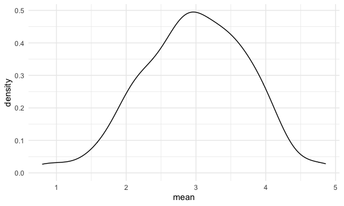

Simulation
================
11/09/2020

## Let’s simulate something

I have a function

``` r
sim_mean_sd = function(samp_size, mu = 3, sigma = 4) {
  
  sim_data = 
      tibble(
        x = rnorm(n = samp_size, mean = mu, sd = sigma)
      )

  sim_data %>% 
    summarize(
      mean = mean(x),
      sd = sd(x)
    )

}
```

I can “simulate” by running this line

``` r
sim_mean_sd(30)
```

    ## # A tibble: 1 x 2
    ##    mean    sd
    ##   <dbl> <dbl>
    ## 1  2.27  3.81

## Let’s simulate a lot

Let’s start with a for loop

``` r
output = vector("list", length = 100)

for (i in 1:100) {
  
  output[[i]] = sim_mean_sd(samp_size = 30)
  
}

bind_rows(output)
```

    ## # A tibble: 100 x 2
    ##     mean    sd
    ##    <dbl> <dbl>
    ##  1  2.81  3.73
    ##  2  2.77  4.37
    ##  3  3.06  4.00
    ##  4  3.11  4.38
    ##  5  2.22  3.57
    ##  6  2.57  3.61
    ##  7  2.76  4.53
    ##  8  3.65  3.62
    ##  9  3.85  4.09
    ## 10  3.08  3.88
    ## # … with 90 more rows

Let’s use a `loop function`.

``` r
sim_results = 
  rerun(100, sim_mean_sd(samp_size = 30)) %>% 
  bind_rows()
```

Let’s look at results…

``` r
sim_results %>% 
  ggplot(aes(x = mean)) + geom_density()
```



``` r
sim_results %>% 
  summarize(
    avg_sample_mean = mean(mean),
    sd_samp_mean = sd(mean) #similar to mean/sqrt(n)
  )
```

    ## # A tibble: 1 x 2
    ##   avg_sample_mean sd_samp_mean
    ##             <dbl>        <dbl>
    ## 1            2.99        0.670

``` r
sim_results %>% 
  ggplot(aes(x = sd)) + geom_density()
```


